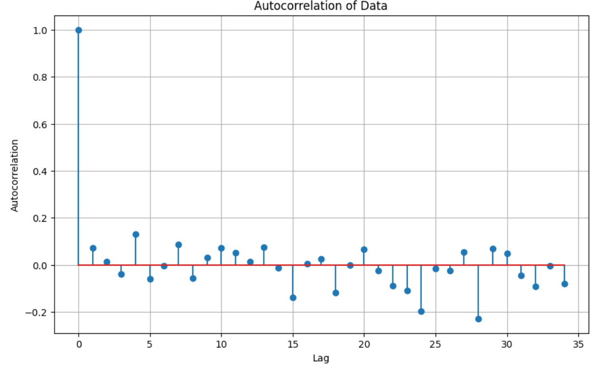

## Devloped by: Sreevalsan V
## Register Number: 212223240158
## Date: 3-03-2025

# Ex.No: 03   COMPUTE THE AUTO FUNCTION(ACF)

### AIM:

To Compute the AutoCorrelation Function (ACF) of the data for the first 35 lags to determine the model
type to fit the data.

### ALGORITHM:
1. Import the necessary packages
2. Find the mean, variance and then implement normalization for the data.
3. Implement the correlation using necessary logic and obtain the results
4. Store the results in an array
5. Represent the result in graphical representation as given below.
### PROGRAM:
```py
import matplotlib.pyplot as plt
import numpy as np
```
Given data
```py
data = [3, 16, 156, 47, 246, 176, 233, 140, 130, 101, 166, 201, 200, 116, 118, 247, 209,
52, 153, 232, 128, 27,192, 168, 208, 187, 228, 86, 30, 151, 18, 254, 76, 112, 67, 244, 179, 150, 89, 49, 83, 147, 90, 33, 6,158, 80, 35, 186, 127]

N=len(data)
```
 Define lags
 ```py
lags = range(35)
```
Pre-allocate autocorrelation table
```py
autocorr_values = []
```
Mean of the data
```py
mean_data = np.mean(data)
```
Variance of the data
```py
variance_data = np.var(data)
```
Normalize the data
```py
normalized_data = (data - mean_data) / np.sqrt(variance_data)
```
Go through lag components one-by-one
```py
for lag in lags:
  if lag == 0:
    autocorr_values.append(1)
  else:
    auto_cov = np.sum((data[:-lag] - mean_data) * (data[lag:] - mean_data)) / N  # Autocovariance
    autocorr_values.append(auto_cov / variance_data)  # Normalize by variance
```
Display the graph
```py
plt.figure(figsize=(10, 6))
plt.stem(lags, autocorr_values)
plt.title('Autocorrelation of Data')
plt.xlabel('Lag')
plt.ylabel('Autocorrelation')
plt.grid(True)
plt.show()
```

### OUTPUT:



### RESULT:
        Thus we have successfully implemented the auto correlation function in python.
